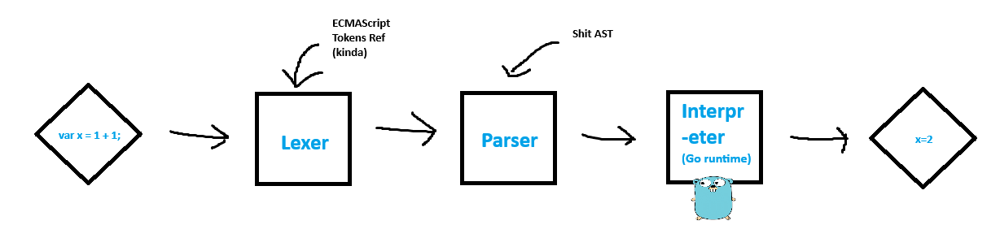

# gojo

Go javascript engine.

## Parts by example:

For the code `var x = 5;`

1. Lexer: Produces a stream of tokens `var, x, =, 5, ;`
2. Parser: Produces an AST `Program -> LetStatement (x = IntegerLiteral 5).`
3. Interpreter: Process the AST and stores the value in the environment.

## Resources

- ECMAScript spec - https://tc39.es/ecma262/
- JSConf rust JS engine talk - https://youtu.be/_uD2pijcSi4
- Writing a tokenizer (not great performance wise but a start) - https://dev.to/ndesmic/writing-a-tokenizer-1j85
- General simple lexer - https://codemaster138.github.io/blog/creating-an-interpreter-part-1-lexer/
- Writing an interpreter in go - https://edu.anarcho-copy.org/Programming%20Languages/Go/writing%20an%20INTERPRETER%20in%20go.pdf
- Acorn js js parser - https://github.com/acornjs/acorn
- Standard compliant parser - https://github.com/jquery/esprima
- AST Explore - https://astexplorer.net/
